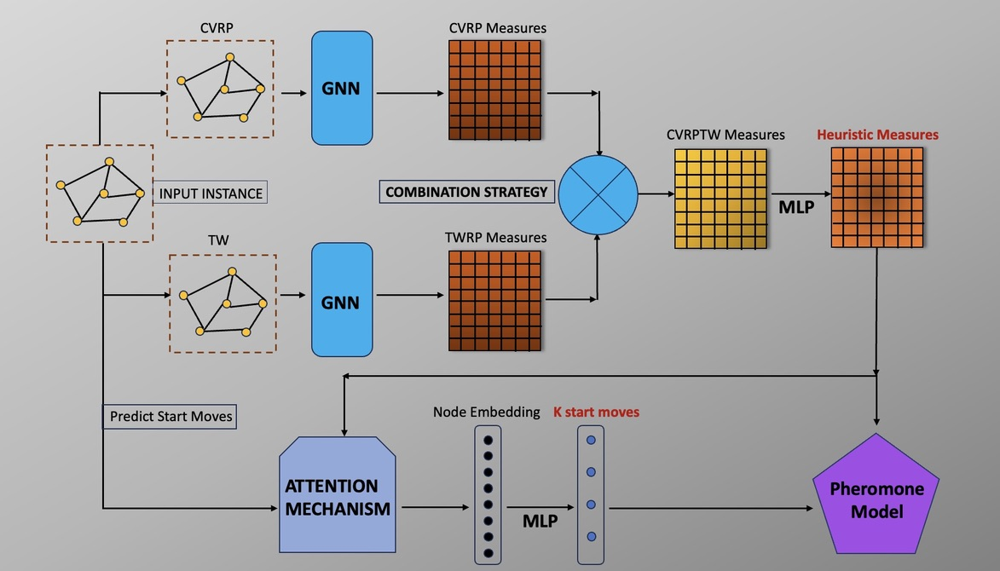

# Introduction
The implementation of model AMO-ACO - Alimentation Deep Multiple Optimal Ant Colony Optimization to solve Vehicle Routing Problem with Time Windows.

We ultilize a novel model by combining both constraints from CVRP and TW problems to generate heuristic measures to strike a balance between vehicle utilization, route optimization, and adherence to time windows through effective combination strategies. 

More detail: [Alimentation Deep Multiple Optimal Ant Colony Optimization to solve Vehicle Routing Problem with Time Windows](AMO-ACO.pdf).



# How to run
Move to **Model/train.py**, change:
> cfg = Data_{}().format(size of graph you want)
```
train(cfg, cfg.graph_size, cfg.n_ants, cfg.steps_per_epoch, cfg.capacity, cfg.epochs)
```
cfg is the config data, which are set up for hyperparameters for 100,200 and 400 CVRPTW dataset.
>
*----**Vote star if you like it! Thanks**----*


